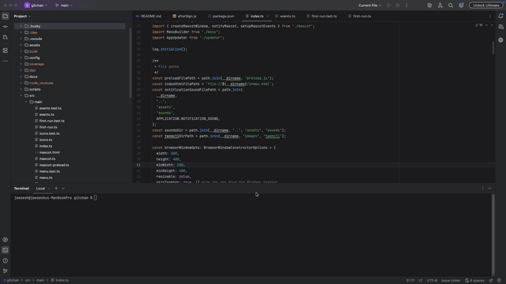
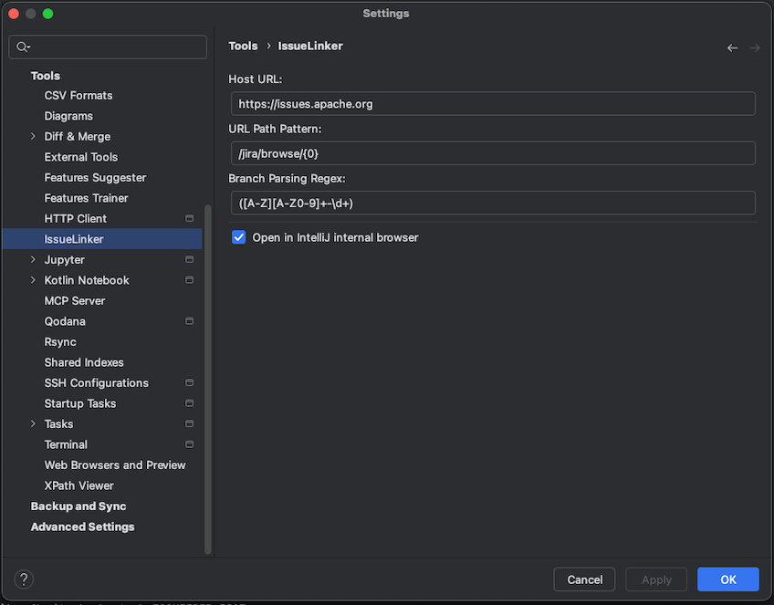
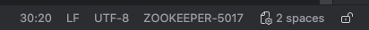
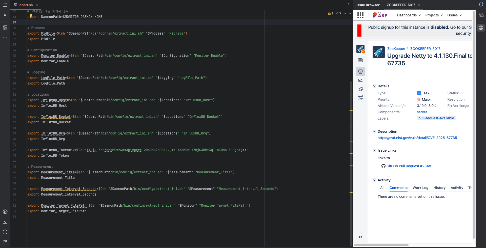

# IssueLinker

[](https://github.com/rojae/issueLinker/actions)
[](https://plugins.jetbrains.com/plugin/MARKETPLACE_ID)
[](https://plugins.jetbrains.com/plugin/MARKETPLACE_ID)

[한국어](README.ko.md)

<!-- Plugin description -->
**IssueLinker** is an IntelliJ IDEA plugin that automatically links your Git branches to issue trackers like Jira, GitHub Issues, GitLab Issues, and more.

Parse issue keys from branch names using configurable regex patterns and open them instantly with a keyboard shortcut.
<!-- Plugin description end -->

## Features

- **Automatic Issue Detection** - Extracts issue keys from Git branch names using configurable regex
- **One-Click Access** - Open linked issues with keyboard shortcut `Cmd+Alt+J` (Mac) / `Ctrl+Alt+J` (Windows/Linux)
- **Status Bar Widget** - Always see your current issue key in the IDE status bar
- **Internal Browser** - View issues in IntelliJ's built-in browser without leaving the IDE
- **Flexible Configuration** - Support for any issue tracker with customizable URL patterns
- **Multiple Capture Groups** - Extract multiple values from branch names using regex groups

## Demo



```
Branch: feature/PROJ-123-add-user-login
           ↓ (regex extracts PROJ-123)
Opens: https://jira.company.com/browse/PROJ-123
```

## Screenshots

### Settings
Configure your issue tracker URL and branch parsing regex.



### Status Bar Widget
See your current issue key in the IDE status bar.



### Issue Browser
View issues in IntelliJ's built-in browser.



## Installation

### From JetBrains Marketplace (Recommended)

1. Open IntelliJ IDEA
2. Go to **Settings/Preferences** → **Plugins** → **Marketplace**
3. Search for "IssueLinker"
4. Click **Install**
5. Restart IDE

### Manual Installation

1. Download the latest release from [Releases](https://github.com/rojae/issueLinker/releases)
2. Go to **Settings/Preferences** → **Plugins** → **⚙️** → **Install Plugin from Disk...**
3. Select the downloaded `.zip` file
4. Restart IDE

## Configuration

Navigate to **Settings/Preferences** → **Tools** → **IssueLinker**

| Setting | Description | Default |
|---------|-------------|---------|
| **Host URL** | Base URL of your issue tracker | `https://jira.company.com` |
| **URL Path Pattern** | Path pattern with placeholders `{0}`, `{1}`, `{2}` for captured groups | `/browse/{0}` |
| **Branch Parsing Regex** | Regex pattern with capture groups to extract issue keys | `([A-Z][A-Z0-9]+-\d+)` |
| **Use Internal Browser** | Open issues in IntelliJ's built-in browser | `true` |

### Configuration Examples

#### Jira
```
Host URL: https://jira.yourcompany.com
URL Path Pattern: /browse/{0}
Branch Regex: ([A-Z][A-Z0-9]+-\d+)

Branch: feature/PROJ-123-add-login → Opens: https://jira.yourcompany.com/browse/PROJ-123
```

#### GitHub Issues
```
Host URL: https://github.com
URL Path Pattern: /yourorg/yourrepo/issues/{0}
Branch Regex: (\d+)

Branch: feature/123-add-login → Opens: https://github.com/yourorg/yourrepo/issues/123
```

#### GitLab Issues
```
Host URL: https://gitlab.com
URL Path Pattern: /yourgroup/yourproject/-/issues/{0}
Branch Regex: (\d+)

Branch: 456-fix-bug → Opens: https://gitlab.com/yourgroup/yourproject/-/issues/456
```

#### Linear
```
Host URL: https://linear.app
URL Path Pattern: /yourteam/issue/{0}
Branch Regex: ([A-Z]+-\d+)

Branch: feature/ENG-456-new-feature → Opens: https://linear.app/yourteam/issue/ENG-456
```

#### Multiple Capture Groups
```
Host URL: https://tracker.company.com
URL Path Pattern: /project/{0}/issue/{1}
Branch Regex: ([a-z]+)/([A-Z]+-\d+)

Branch: feature/PROJ-123 → Opens: https://tracker.company.com/project/feature/issue/PROJ-123
```

## Usage

### Keyboard Shortcut
| Platform | Shortcut |
|----------|----------|
| macOS | `Cmd + Alt + J` |
| Windows/Linux | `Ctrl + Alt + J` |

### Status Bar Widget
Click the issue key displayed in the bottom-right status bar to open the linked issue.

### Context Menu
Right-click in the editor or project view and select **Open Issue in Browser**.

### Tools Menu
Go to **Tools** → **Open Issue in Browser**

## Requirements

- IntelliJ IDEA 2024.3 or later (or other JetBrains IDEs)
- Git integration enabled
- Java 21+ runtime

## Building from Source

```bash
# Clone the repository
git clone https://github.com/rojae/issueLinker.git
cd issueLinker

# Build the plugin
./gradlew build

# Run in sandbox IDE for testing
./gradlew runIde

# Build distribution zip
./gradlew buildPlugin
# Output: build/distributions/issueLinker-*.zip
```

## Publishing to JetBrains Marketplace

### 1. Prepare for Release

Update version in `gradle.properties`:
```properties
pluginVersion=1.0.0
```

### 2. Build Distribution

```bash
# Close IntelliJ IDEA first, then run:
./gradlew buildPlugin
```

The plugin zip will be created at `build/distributions/issueLinker-{version}.zip`

### 3. Upload to Marketplace

1. Go to [JetBrains Marketplace](https://plugins.jetbrains.com/)
2. Sign in with your JetBrains account
3. Click **Upload plugin**
4. Upload the zip file from `build/distributions/`
5. Fill in plugin details and submit for review

### 4. Automated Publishing (CI/CD)

Add your JetBrains Marketplace token to GitHub Secrets as `PUBLISH_TOKEN`, then:

```bash
./gradlew publishPlugin
```

Get your token from [JetBrains Hub](https://hub.jetbrains.com/users/me?tab=authentification).

## Contributing

Contributions are welcome! Please feel free to submit a Pull Request.

1. Fork the repository
2. Create your feature branch (`git checkout -b feature/amazing-feature`)
3. Commit your changes (`git commit -m 'Add amazing feature'`)
4. Push to the branch (`git push origin feature/amazing-feature`)
5. Open a Pull Request

## License

This project is licensed under the **MIT License with Commons Clause** - see the [LICENSE](LICENSE) file for details.

- ✅ Free to use (including commercial/enterprise use)
- ✅ Free to modify for personal use
- ❌ Cannot sell the software or modified versions

## Acknowledgments

- Built with [IntelliJ Platform Plugin Template](https://github.com/JetBrains/intellij-platform-plugin-template)
- Inspired by the need to quickly navigate between code and issue trackers

---

**Made with ❤️ by [rojae](https://github.com/rojae)**
